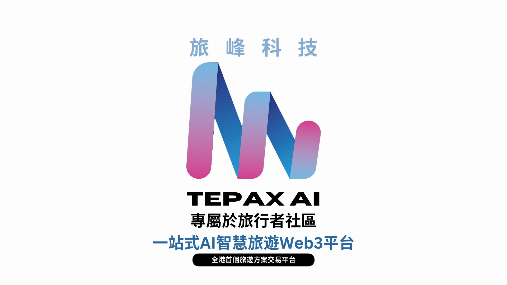
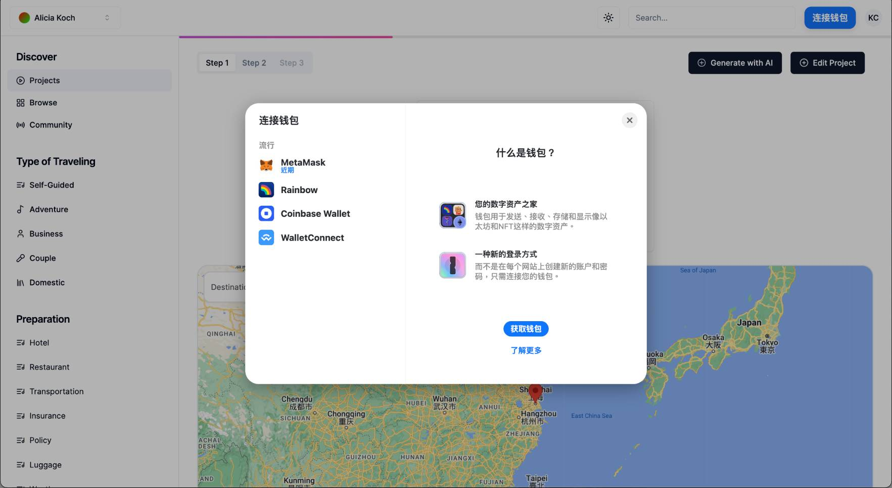
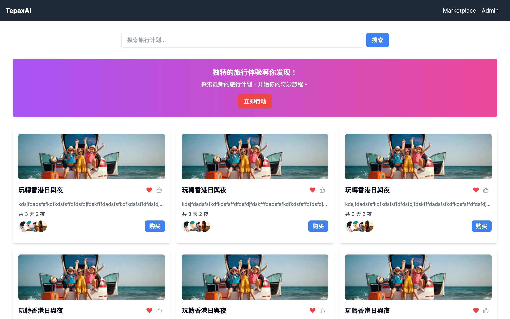
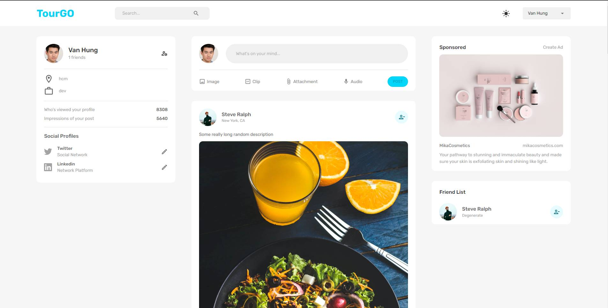

# TourGo



Tepax AI, your global travel assistant! Our mission is to **make your travels fulfilling and purposeful**. With advanced artificial intelligence technology, we provide you with **unique travel solutions**. By interacting with our vast user data, our AI models are constantly evolving to provide the latest **personalized services**.

## Table Content
- [Module](#Module)
- [Introduction](#Introduction)
- [Features](#Features)
- [Run](#Run)

# Module
- Online Travel Solution Planner
- Travel Solution Marketplace
- Traveler Community

# Introduction
## Online Travel Solution Planner
**`trip-planner`**

Design the interface to avoid a text-based format, incorporating a user-friendly interface that **extensively comprehends user preferences** and a flexible interactive graphical editor to enhance user interaction with travel solutions.


## Travel Solution Marketplace
**`marketplace`**
TourGo provides a **metaverse platform**, where travel creator interact with other users, earn income through selling virtual products and offering virtual travel experiences, and showcase their work to attract more attention from travelers, thereby increasing their visibility.


## Traveler Community
**`tourgo-community`**

Community interaction is at the core of our platform, providing **valuable opportunities** for businesses, merchants, and users. Users can share their travel experiences, offer feedback to businesses, increase brand exposure, while businesses can use this platform for **promotion**, offering discounts, building connections, and attracting new customers. This interactive community **enriches the user experience** and enhances the platform's appeal.

# Features
## Online Travel Solution Planner
- Input your **travel destination** and dates.
- Set your **travel companions** to collaboratively edit the travel plan.
- AI generates a personalized **travel itinerary**.
- Utilize NLP models to modify the content.

## Travel Solution Marketplace
- Utilize **blockchain technology** and **cold wallets** for transactions.
- Support 8 or more cold wallet providers.
- Encourage users to autonomously maintain the ecosystem through **DAO** (Decentralized Autonomous Organization).
## Traveler Community
- Support a large number of users accessing simultaneously.
- Create and edit your own posts.
- Comment on and like others' posts.
- Expand your social circle through **dynamic messages** and **exploration**.

# Run
## Online Travel Solution Planner
1. Go to the project directory
```
cd .\trip-planner\    
```
2. Install Client dependencies
```
cd .\client\
npm i
```
3. Run the client
```
npm run dev
```
## Travel Solution Marketplace
1. Go to the project directory
```
cd .\marketplace\
```
2. Install Client dependencies
```
npm i
```
3. Run the client
```
npm run dev
```
## Traveler Community
1. Go to the project directory
```
cd .\tourgo-community\
```

### Client
1. Install Client dependencies
```
cd .\client\
npm i react-redux @reduxjs/toolkit redux-persist react-dropzone dotenv formik yup react-router-dom@6 @mui/material @emotion/react @emotion/styled @mui/icons-material
```
2. Run the client
```
npm run start
```
### Server
1. Go to Server directory `cd ..\server\` Install Client dependencies
```
npm i express body-parser bcrypt cors dotenv gridfs-stream multer multer-gridfs-storage helmet morgan jsonwebtoken mongoose
```
2. Run the server
```
node index.js
```